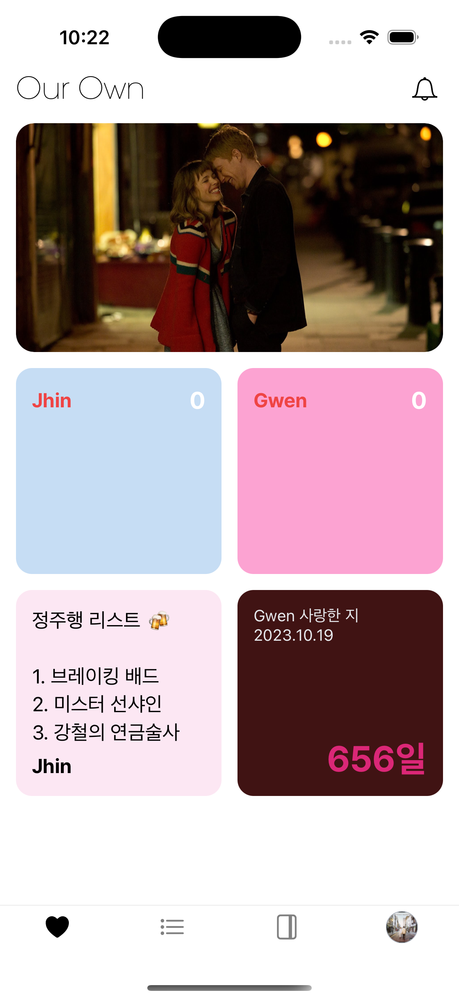
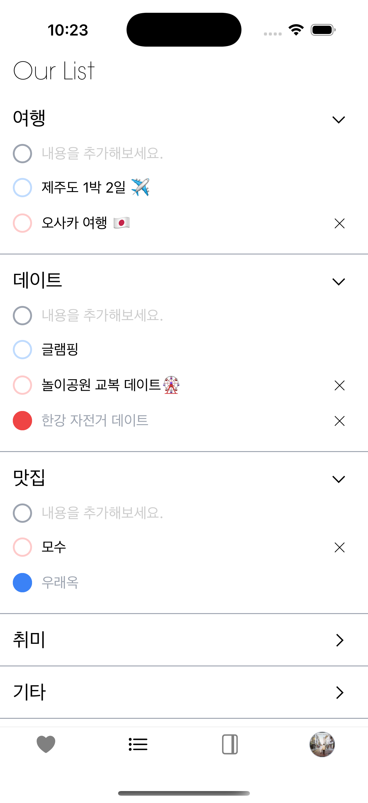
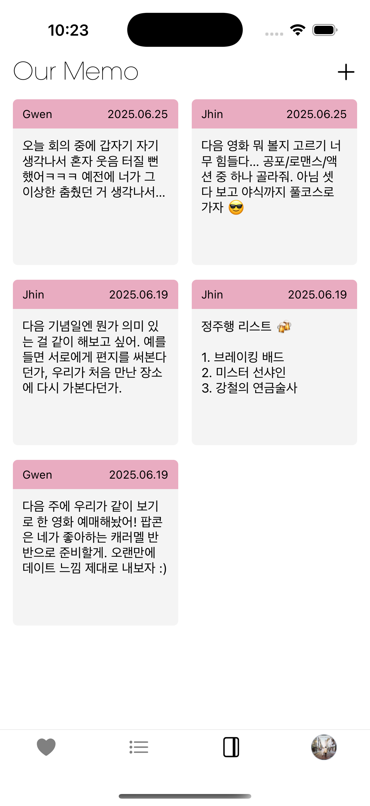
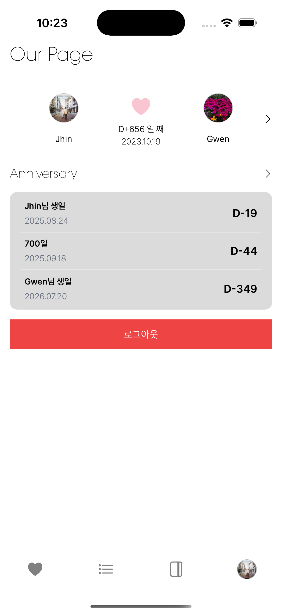

## 👩‍❤️‍👨 Our Own : 커플 전용 공유형 라이프 매니저

### 우리만의 공간, 우리가 함께 소유한 기록

OurOwn은 커플이 함께 쓰는 할 일, 메모, 기념일 등 일상 속 소소한 순간들을 공유하고 기록할 수 있는 앱입니다.
단순한 메신저나 캘린더를 넘어서, 연인 간의 관계를 더 단단하게 만들어줄 '우리만의 공간'을 만드는 것이 목적입니다.

## ⚒️ Tech Spec

### 📱 Frontend

- **Language:** TypeScript
- **Framework:** React Native
- **Development Platform:** Expo
- **State Management:** Zustand
- **Styling:** NativeWind (Tailwind CSS for React Native)
- **HTTP Client:** Axios
- **Navigation:** Expo Router

## 📱 주요 기능

### OAuth 로그인

- 카카오, 구글 OAuth를 통해 간편하게 로그인이 가능합니다.

### 🏠 Our Own (홈 화면)

- 서로의 To-do를 작성하고 실시간으로 공유할 수 있습니다.
- 위젯 포토와 위젯 메모 기능을 활용해 홈 화면을 나만의 스타일로 꾸밀 수 있습니다.

### 📝 Our List (버킷 리스트)

- 함께 이루고 싶은 버킷리스트를 작성하고 공유할 수 있습니다.
- 완료한 항목은 체크하여 함께 성취감을 느낄 수 있습니다.

### 📓 Our Memo

- 중요한 순간이나 일상을 기록할 수 있는 공유 메모 기능을 제공합니다.
- 작성한 메모는 커플과 함께 확인하고 수정할 수 있습니다.

### 🙋 Our Page

- 닉네임, 프로필 사진, 생일 등 나의 정보를 자유롭게 수정할 수 있습니다.
- 다가오는 기념일을 확인하고 새로운 기념일도 직접 추가할 수 있습니다.
